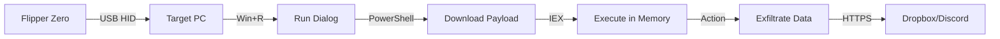

# 📦 DEPLOYMENT GUIDE
## AUSTRALIS Red Team Arsenal - Operational Procedures

---

## 🎯 Prerequisites

### Hardware Requirements
- **Flipper Zero** (Firmware 0.80.0+)
- **microSD Card** (recommended: 8GB+)
- **Target System**: Windows 10 (1809+) or Windows 11
- **USB Cable** (for Flipper Zero connectivity)

### Software Requirements
- **PowerShell 5.1+** (pre-installed on Windows 10/11)
- **.NET Framework 4.5+** (for some modules)
- **Internet Connection** (for exfiltration modules)

### Optional: Exfiltration Configuration
- **Dropbox API Token** ([Create App](https://www.dropbox.com/developers/apps))
- **Discord Webhook URL** ([Server Settings → Integrations](https://support.discord.com/hc/en-us/articles/228383668))

---

## 🔧 Configuration

### 1. Dropbox Setup (for Exfiltration Modules)

#### Create Dropbox App
1. Visit [Dropbox App Console](https://www.dropbox.com/developers/apps)
2. Click **"Create App"**
3. Choose **"Scoped Access"**
4. Choose **"Full Dropbox"** access
5. Name your app (e.g., `AustralisExfil`)

#### Generate Access Token
1. Go to **Permissions** tab
2. Enable: `files.content.write`, `files.metadata.write`
3. Go to **Settings** tab
4. Under **OAuth 2**, generate **Access Token**
5. Copy token (starts with `sl.`)

#### Configure Modules
Edit scripts or use environment variables:

**Option A: Environment Variables (Recommended)**
```powershell
# Set for current session
$env:DROPBOX_TOKEN = "sl.your_token_here"

# Set permanently (Windows)
[System.Environment]::SetEnvironmentVariable('DROPBOX_TOKEN', 'sl.your_token_here', 'User')
```

**Option B: Direct Script Edit**
```powershell
# Edit each module's .ps1 file
# Find line: $db = $env:DROPBOX_TOKEN
# Replace with: $db = "sl.your_token_here"
```

### 2. Discord Webhook Setup (Optional)

1. Open Discord Server → Server Settings → Integrations
2. Click **"Create Webhook"**
3. Configure channel and name
4. Copy **Webhook URL**
5. Set environment variable:
```powershell
$env:DISCORD_WEBHOOK = "https://discord.com/api/webhooks/..."
```

---

## 🚀 Flipper Zero Deployment

### Prepare Flipper Zero

1️⃣ **Update Firmware**
```
Settings → System → Update → Update Firmware
```

2️⃣ **Insert microSD Card**
- Formatted as FAT32
- Create folder structure: `SD:/badusb/`

3️⃣ **Transfer Payloads**
- Connect Flipper via USB
- Copy `DuckyScript_*.txt` files from modules to `SD:/badusb/`

### File Transfer Methods

**Method A: qFlipper (Recommended)**
1. Download [qFlipper](https://flipperzero.one/update)
2. Connect Flipper Zero
3. Navigate to **File Manager**
4. Browse to `SD Card/badusb/`
5. Upload `DuckyScript_*.txt` files

**Method B: Direct SD Card**
1. Remove microSD from Flipper
2. Insert into PC card reader
3. Copy files to `badusb/` folder
4. Safely eject and reinsert into Flipper

---

## ⚡ Execution Workflow

### Standard Attack Chain



### Step-by-Step Execution

1️⃣ **Physical Access**
- Plug Flipper Zero into target Windows machine
- Wait for USB enumeration (~2 seconds)

2️⃣ **Launch Payload**
```
Flipper Menu:
  Bad USB → [Select DuckyScript_*.txt] → Run
```

3️⃣ **Payload Actions**
- Flipper emulates keyboard
- Opens PowerShell with `Win+R` → `powershell`
- Injects command to download & execute script
- Script runs in memory (fileless)

4️⃣ **Exfiltration** (if configured)
- Data uploaded to Dropbox/Discord
- Local traces cleaned (for evasion modules)

5️⃣ **Completion**
- Flipper shows "Done" or LED indicator
- Safe to disconnect

---

## 🔬 Module-Specific Deployment

### Credential_Phishing
**Scenario**: Harvest credentials via fake auth prompt

**Execution**:
```
Bad USB → DuckyScript_Phish.txt
```

**Expected Behavior**:
- Fake Windows Security prompt appears
- Waits for mouse movement (anti-sandbox)
- Captures entered credentials
- Uploads to Dropbox & Discord

**Forensic Artifacts**:
- Event ID 4104 (Script Block Logging)
- Alternate Data Streams in temp files

---

### Persistence_Keylogger
**Scenario**: Install persistent keylogger

**Execution**:
```
Bad USB → DuckyScript_Keylogger.txt
```

**Expected Behavior**:
- Installs hidden keylogger
- Captures keystrokes
- Periodically uploads logs to Dropbox
- Uses timestomping to hide creation time

**Termination**:
```powershell
# Create stop signal
New-Item -Path "$env:TEMP\stop.txt" -ItemType File
```

**Forensic Artifacts**:
- USN Journal timestamp discrepancies
- PowerShell Operational logs

---

### Discovery_System_Recon
**Scenario**: Enumerate system information

**Execution**:
```
Bad USB → DuckyScript_Recon.txt
```

**Expected Behavior**:
- Collects OS, network, hardware, software info
- Creates massive USN Journal activity
- Compresses data to ZIP
- Uploads to Dropbox

**Forensic Artifacts**:
- Thousands of file create/delete events
- Event ID 4104 with large base64 blocks

---

### Defense_Evasion_Cleanup
**Scenario**: Anti-forensic cleanup

**Execution**:
```
Bad USB → (module in progress - manual execution)
```

**Actions**:
- Clears PowerShell history
- Deletes temp files
- Empties Recycle Bin
- Clears Run dialog history

---

## 🛡️ Operational Security (OpSec)

### For Red Team Operations

✅ **Best Practices**:
- Use dedicated Dropbox/Discord accounts (not personal)
- Rotate tokens after each engagement
- Test in isolated VM before production use
- Document all actions for reporting

⚠️ **Avoid**:
- Hardcoding tokens in Git repositories
- Using same token across multiple engagements
- Testing on production systems without authorization

### For Blue Team Training

✅ **Setup**:
- Deploy in isolated network
- Enable PowerShell Script Block Logging:
```powershell
# Enable via GPO or registry
New-ItemProperty -Path "HKLM:\SOFTWARE\Policies\Microsoft\Windows\PowerShell\ScriptBlockLogging" -Name "EnableScriptBlockLogging" -Value 1 -PropertyType DWord
```
- Configure Sysmon for enhanced telemetry
- Enable USN Journal monitoring

---

## 🔍 Troubleshooting

### Payload Doesn't Execute

**Issue**: Flipper injects keystrokes but nothing happens

**Solutions**:
1. Check keyboard layout (script expects US layout)
2. Increase delays in DuckyScript (`DELAY 1000`)
3. Verify PowerShell execution policy:
```powershell
Get-ExecutionPolicy
# Should allow scripts or use -ep Bypass flag
```

### Exfiltration Fails

**Issue**: Script runs but no data uploaded

**Solutions**:
1. Verify Dropbox token validity (test with curl)
2. Check internet connectivity
3. Review PowerShell errors:
```powershell
$Error[0] | Format-List -Force
```

### Script Blocked by Antivirus

**Issue**: Windows Defender blocks execution

**Solutions** (Training Environment Only):
1. Temporarily disable Real-Time Protection
2. Add exclusion for PowerShell scripts
3. Use obfuscation (see Module README files)

---

## 📞 Support

For deployment issues:
1. Check module-specific `README.md`
2. Review [FORENSICS_GUIDE.md](FORENSICS_GUIDE.md) for expected artifacts
3. Submit GitHub Issue with logs

---

**Operational Deployment Complete** ✅
